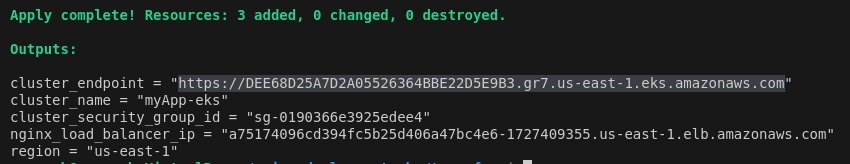
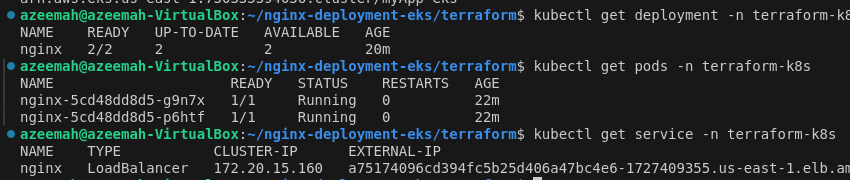
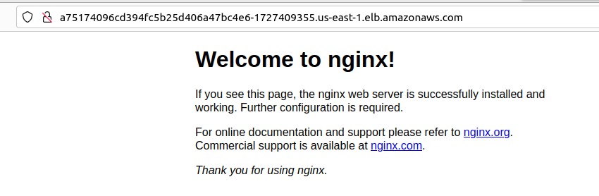

# Provision and Deploy Infrastructure Seamlessly Using Terraform #

**Project Overview**

This project demonstrates the deployment of a Kubernetes cluster using Terraform and the integration of a CI/CD pipeline with GitHub Actions. The infrastructure is provisioned as code, ensuring consistency and scalability, while the CI/CD pipeline automates application deployment for seamless delivery.

**Terraform:**

Terraform is an open-source Infrastructure as Code (IaC) tool used to automate and manage cloud infrastructure. It allows you to define infrastructure resources (like servers, databases, and networks) in declarative configuration files and then provision them consistently across different environments.

**Kubernetes:**

Kubernetes is an open-source container orchestration platform designed to automate the deployment, scaling, and management of containerized applications. It helps ensure high availability, scalability, and efficient resource utilization across clusters of machines.

**Github actions:**

GitHub Actions is a CI/CD platform that allows you to automate workflows directly within your GitHub repository. It enables tasks like building, testing, and deploying code whenever specific events occur (e.g., push or pull requests). You can define workflows using YAML files to handle continuous integration and deployment pipelines.

These tools work well together to streamline infrastructure management and application deployment.


**Prerequisites**
- AWS account
- IAM user with administrator or neccessary role enabled
- Terraform [Install terraform](https://developer.hashicorp.com/terraform/install)
- AWSCLI [Install awscli](https://docs.aws.amazon.com/cli/latest/userguide/getting-started-install.html)

**Step by step guide**
lets run our code manually before we attempt using CI/CD workflow.

- Configure your AWS credentials so that the AWS CLI can authenticate and interact with your AWS account

```
aws configure
```

- Create a terraform diretory and cd into it

```
mkdir terraform
cd terraform
```

- Create terraform configuration files 

`providers.tf` _contains all the providers needed for this project_

`variables.tf` _defines input variables_

`main.tf` _contains;_ 
- _Modules for VPC and EKS Cluster: creates a Virtual Private Cloud (VPC) and an Amazon EKS cluster, allowing for simpler and more concise code._

- _Kubernetes Provider: defines the Kubernetes provider for Terraform to deploy Kubernetes resources on the created cluster, all within a single .tf file, this ensures unified workflow and full life cycle management_

- _Configure the Kubernetes Provider: Using cloud specific plugins, the exec plugin is utilized in the Kubernetes provider block to handle authentication, as the AWS token expires every 15 minutes._

`outputs.tf` _define output values that are displayed after the deployment completes_

`terraform.tfvars` _file assigns values to the input variables defined in `variables.tf`. This file contains sensitive information, such as AWS credentials or other configuration settings, and should not be exposed publicly, such as by pushing it to GitHub. Instead, it's best practice to store it as a secret variable in your repository's settings to ensure that sensitive information is kept secure._

- Run the terraform command

`terraform init` _initializes the repository, adding all the dependencies required._

`terraform plan` _plan the changes to be added or removed, essentially a preview of what `terraform apply` will do, allowing you to review and confirm_ 

`terraofrm apply --auto-approve` _apply without prompt_

- Confirm cluster is created and application is properly deployed on it, this can be done in two ways:

_aws console - check if cluster is running, nodes are healthy, check the loadbalancer for ip or dns name, open via browser, nginx app is successfully displayed_


_using kubectl - [install kubectl](https://kubernetes.io/docs/tasks/tools/install-kubectl), configure the kubectl to interact with the cluster `aws eks --region us-east-1 update-kubeconfig --name <cluster_name>`. can run kubectl commands to get deployment, service, pods and others `kubectl get all -n <namespace>`_


- Run `terraform destroy --auto-approve` we can safely destroy after confirm the configuration files are good.

- CI/CD workflow - to run this fully automated, create `.github/workflows` directory and two yaml files in it, one is execute our terraform apply and the other to destroy when done.

`terraform.yaml` _ [save](https://docs.github.com/en/actions/security-for-github-actions/security-guides/using-secrets-in-github-actions#creating-secrets-for-a-repository) your access key, secret key and region in your repository secret variable_

`terraform-destroy.yml` _it's essential to have access to the .tfstate file to ensure that you can properly delete the resources you created, such as the cluster. Instead of pushing your .tfstate to a repository (which is not secure), you should store it remotely. One recommended option is using an S3 bucket as the remote backend for your Terraform state._

To do this, you can create a `backend.tf` file that specifies the S3 bucket as the remote backend for storing the .tfstate file. 

`terraform-destroy.yml` _set to run manually instead of running on push_

- Push to Github, and the `terraform.yml` will run on push

- Confirm by accessing your loadbalancer IP or dns name via browser



- Manually run the workflow of `terraform-destroy.yml`

**Conclusion**

- Time-Saving: Automating the deployment process saves time and effort, making it easier to manage infrastructure.

- Consistency: Automation leads to more reliable deployments, reducing mistakes and ensuring everything works as expected.

- Scalability: Automated workflows can easily grow with your project, allowing for faster updates without losing quality.

- Better Teamwork: Integrating tools like Terraform and Kubernetes with GitHub Actions helps team members collaborate more effectively.

- Flexibility: A well-defined CI/CD pipeline allows teams to quickly adjust to changes, improving overall project speed and adaptability.

